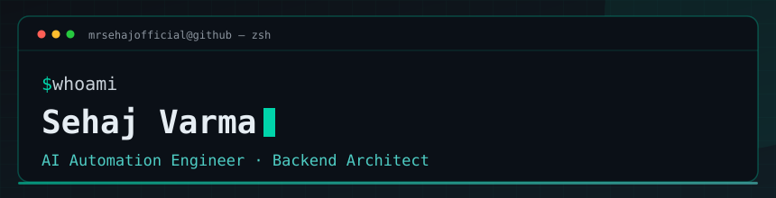

I'm an AI automation engineer and backend developer based in India. I build LLM agents, RAG pipelines, and Python backends — systems that keep running when nobody is watching them. Every claim on this page links to code you can read.

## What I Build

| Domain | What I Ship | Stack |
|------------|-----------------|-----------|
| 🤖 **LLM Agents** | Autonomous agents, prompt orchestration, multi-agent workflows | LangChain, LangGraph, CrewAI, OpenAI, Gemini |
| 🧠 **RAG Pipelines** | Hybrid retrieval, reranking, grounded generation, eval harnesses | LlamaIndex, Pinecone, Chroma |
| ⚡ **AI Automation** | Telegram bots, business workflows, scheduled agents | Python, AsyncIO, n8n |
| 🏗️ **Backend Systems** | REST APIs, real-time systems, distributed workflows | Flask, FastAPI, SQLAlchemy, PostgreSQL, Redis |
| 📱 **Cross-Platform** | Flutter apps with integrated AI | Flutter, Dart, custom protocol layer |

## Featured Projects

### [Aegis](https://github.com/mrsehajofficial/aegis) — Telegram Group Management Bot
Open-source (AGPL-3.0) Telegram group management bot. Sliding-window anti-flood, granular content locks, warning cascades, audit logs, and Telegram Business auto-replies — with CI on every push and an interactive setup wizard (`python -m app.setup`).

`Python 3.11+` `python-telegram-bot v21` `SQLAlchemy 2.0` `AsyncIO` `Docker` `AGPL-3.0`

[Source](https://github.com/mrsehajofficial/aegis) · [Live site](https://aegis.wasmer.app)

### [Amai-Yuki](https://github.com/mrsehajofficial/Amai-Yuki) — Real-Time Messaging App
Flutter messaging app with a custom communication protocol and an LLM-integrated chat layer. Frontend is open-source; the backend stays private.

`Flutter` `Dart` `Custom protocol layer` `LLM chat integration`

[Source](https://github.com/mrsehajofficial/Amai-Yuki)

### [Rag-pipeline](https://github.com/mrsehajofficial/Rag-pipeline) — Retrieval-Augmented Generation
Production-shaped RAG pipeline: document ingestion, hybrid retrieval with score fusion, reranking, grounded generation, and a retrieval eval harness. Zero-dependency core — runs on a bare Python 3.10+ install.

`Python` `LlamaIndex` `Hybrid retrieval` `Reranking` `Eval harness`

[Source](https://github.com/mrsehajofficial/Rag-pipeline)

## Tech Stack

**AI & ML**

**Backend & Infrastructure**

**Frontend & Mobile**

**Automation & DevOps**

## Currently Exploring

- **Programming Language Design** — Ovyth, a custom compiled language, compiler architecture, and native code generation
- **Agent-to-Agent Protocols** — MCP, A2A, custom orchestration layers
- **Local-First AI** — Ollama, llama.cpp, on-device inference optimization
- **Eval-Driven Development** — LLM-as-judge, synthetic datasets, regression testing for prompts
- **Rust for AI Infra** — High-performance async runtimes, memory safety without GC pauses

## GitHub Stats

  
  

  

  

## Contribution Snake

  <picture>
    <source media="(prefers-color-scheme: dark)" srcset="https://raw.githubusercontent.com/mrsehajofficial/mrsehajofficial/output/github-contribution-grid-snake-dark.svg" />
    <source media="(prefers-color-scheme: light)" srcset="https://raw.githubusercontent.com/mrsehajofficial/mrsehajofficial/output/github-contribution-grid-snake.svg" />
    
  </picture>

  Generated daily from my contribution graph via <a href="https://github.com/mrsehajofficial/mrsehajofficial/actions/workflows/snake.yml">GitHub Actions</a>

## Connect

  
  
  
  
  
  

## Philosophy

> **"Ship systems that work in production, not on my machine."**

- **Proof over promises** — Every claim here links to code you can read
- **Open source by default** — AGPL/MIT unless security demands otherwise
- **Deterministic systems** — Tested in CI, not vibes
- **Boring tech, exciting results** — Proven stacks, novel applications

  ⭐ Star repos that help you • 🐛 Open issues for bugs • 💡 PRs welcome • 🤝 Let's build something

